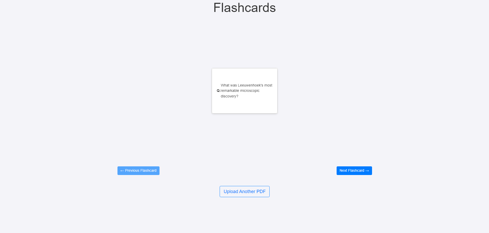

# Flashcard APP

## Description
Flashcard APP is a simple and efficient tool designed to help you create personalized flashcards. By uploading your PDF documents, the app uses Hugging Face’s free models to extract relevant text and generate question-answer pairs from the content. These pairs are then displayed for you to review, aiding in efficient studying or learning. Perfect for students or anyone looking to quickly convert information into flashcards.

## Features
- **PDF to Flashcards:** Upload PDFs, and the app will automatically generate question-answer pairs based on the text extracted.
- **Hugging Face Integration:** Utilizes Hugging Face’s free models to extract the most relevant information from your documents.
- **User-friendly Interface:** Clean and simple interface, making it easy to review and study your flashcards.

## Technology Stack
- **Flask** - Backend framework used for creating the app.
- **Python** - Primary programming language.
- **HTML/CSS/JavaScript** - For frontend development and app interactivity.

## Screenshots

## License
*No license specified.*
